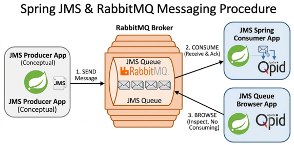
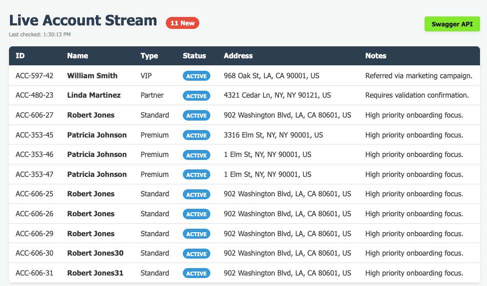
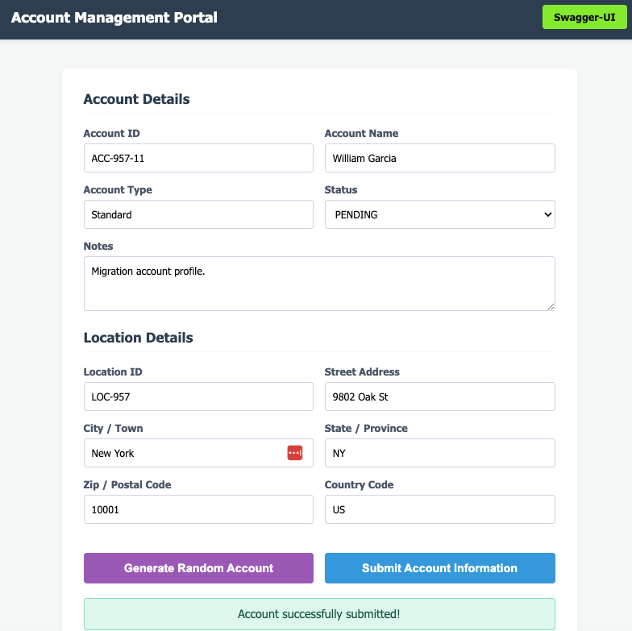
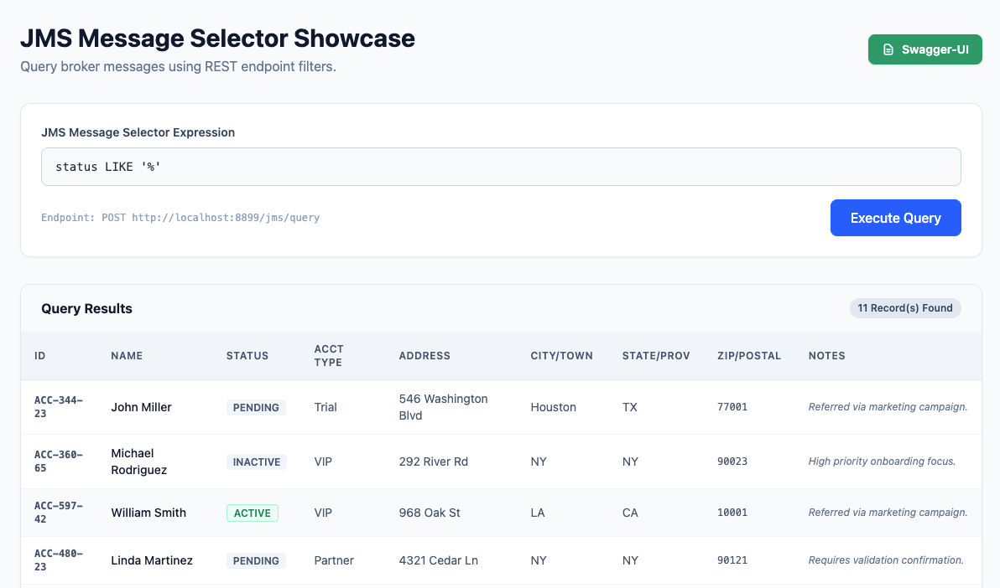

# RabbitMQ JMS

This project showcases the new **Tanzu RabbitMQ JMS Queue** type.



## Getting Started

### Start Tanzu RabbitMQ

```shell
deployment/local/containers/tanzu/tanzu-rabbit.sh
```

### Optional: Pre‑create the JMS queue

```shell
rabbitmqadmin \
  -u "$TANZU_RABBIT_USERNAME" \
  -p "$TANZU_RABBIT_PASSWORD" \
  declare queue \
    --name accounts \
    --arguments='{"x-queue-type":"jms","x-selector-fields":["name","status","city","state","zip"]}' \
    --vhost="/"
```

> **Tip:** Adjust the `x-selector-fields` list to match the attributes you’ll filter on.

## Starting Applications

### JMS Consumer

```shell
java -jar \
  applications/jms/qid/jms-qpid-consumer-app/target/jms-qpid-consumer-app-0.0.1-SNAPSHOT.jar \
  --app.queue.name=accounts \
  --app.queue.selector-fields=name,status,city,state,zip \
  --app.message.selector="status = 'ACTIVE' AND (state = 'NY' OR state = 'CA') AND city IN ('NY', 'LA', 'IM','ANI') AND (zip LIKE '90%' OR zip LIKE '80%')"
```

> Open the UI in a browser:  
> `open http://localhost:8855`



### JMS Producer – No delay

```shell
java -jar \
  applications/jms/qid/jms-qpid-producer-app/target/jms-qpid-producer-app-0.0.1-SNAPSHOT.jar \
  --server.port=8077 \
  --app.queue.name=accounts \
  --app.delivery.delay.ms=0
```

> Launch the UI: `open http://localhost:8077`



### JMS Producer – 10 delay

```shell
java -jar \
  applications/jms/qid/jms-qpid-producer-app/target/jms-qpid-producer-app-0.0.1-SNAPSHOT.jar \
  --server.port=8177 \
  --app.queue.name=accounts \
  --app.delivery.delay.ms=10000
```

> Launch the UI: `open http://localhost:8177`


### Query Browser

```shell
java -jar \
  applications/jms/qid/jms-query-browser/target/jms-query-browser-0.0.1-SNAPSHOT.jar \
  --server.port=8899
```

> Open the browser: `open http://localhost:8899`

