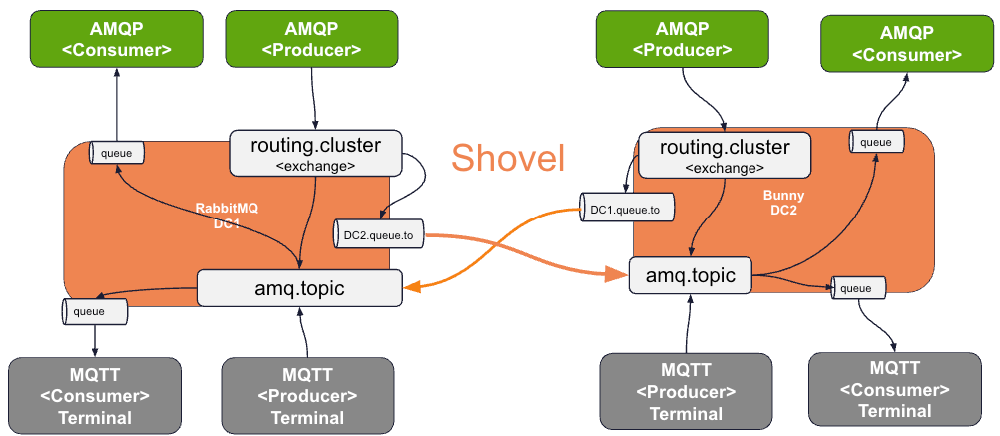

# MQTT AMQP Multi-Cluster Bi-Directional

The following demonstrates achieving 
Bi-directional communications for AMQP and MQTT applications
across multiple clusters. To simplify the demo, a single broker is used to 
represent a "cluster".




In this example, the AMQP Publisher publishes to a 
routing cluster exchange. The routing cluster exchange 
publishes to the amq.topic exchange in both clusters.
This allows publishers to send messages to consumers in either cluster.

Note that in this example, Only the AMQP publishers are bi-directional. MQTT publisher will only send messages in a single cluster. In this example, it is important to have a AMQP application in each cluster handle to MQTT application switching between clusters.

MQTT Consumers that are switched from cluster 1 to 2 receive messages pubblisher
from any AMQP publisher for messages sent to the routing clusters. MQTT Consumer that use clean sessions will have messages removed automatically when switched from one cluster to another.


## Optimizing Cross Cluster Communication

In this demo, the AMQP messages are always forwarded across multiple clusters. Alternatively, the AMQP app can send messages to the amq.topic exchange.
If this message can't be routed in the local Rabbit cluster, then the application can route it via the alternate exchange to the DC*.queue.to (shovel) queue.


# Getting Started

Start RabbitMQ 1 (a.k.a. Hare)


```shell
./deployment/local/containers/rabbit.sh
```


Start RabbitMQ 2 (a.k.a. Bunny)

```shell
deployment/local/containers/bunny.sh
```


Create Exchange on Rabbit 1

```shell
podman exec -it  rabbitmq rabbitmqadmin declare exchange name=routing-cluster  type=topic durable=true
```


Create Queue on Rabbit 1

```shell
podman exec -it  rabbitmq rabbitmqadmin declare queue name=bunny-queue  queue_type=quorum 
```


Defined Binding on Rabbit 1

```shell
podman exec -it  rabbitmq rabbitmqadmin declare binding source=routing-cluster destination=bunny-queue  routing_key="#"
```

```shell
podman exec -it  rabbitmq rabbitmqadmin declare binding source=routing-cluster destination=amq.topic destination_type="exchange"  routing_key="#"
```


Adds a shovel upstream named "origin" to Rabbit 2

```shell
podman exec -it  rabbitmq  rabbitmqctl set_parameter shovel bunny-shovel \
  '{"src-protocol": "amqp091", "src-uri": "amqp://", "src-queue": "bunny-queue", "dest-protocol": "amqp091", "dest-uri": "amqp://bunny", "dest-exchange": "amq.topic"}'
```


Create Exchange on Rabbit 2

```shell
podman exec -it  bunny rabbitmqadmin declare exchange name=routing-cluster  type=topic durable=true
```


Create Queue on Rabbit 2

```shell
podman exec -it  bunny rabbitmqadmin declare queue name=hare-queue  queue_type=quorum 
```


Defined Binding on Rabbit 2

```shell
podman exec -it  bunny rabbitmqadmin declare binding source=routing-cluster destination=hare-queue  routing_key="#"
```

```shell
podman exec -it  bunny rabbitmqadmin declare binding source=routing-cluster destination=amq.topic destination_type="exchange"  routing_key="#"
```

Adds a shovel upstream named "origin" to Rabbit 1 

```shell
podman exec -it  bunny  rabbitmqctl set_parameter shovel hare-shovel \
  '{"src-protocol": "amqp091", "src-uri": "amqp://", "src-queue": "hare-queue", "dest-protocol": "amqp091", "dest-uri": "amqp://rabbitmq", "dest-exchange": "amq.topic"}'
```

```shell
open http://localhost:25672
```

----------------------

Start Source - cluster 1 - AMQP

```shell
java -jar applications/sources/http-amqp-source/target/http-amqp-source-1.0.0.jar --spring.rabbitmq.host=localhost --server.port=8551 --spring.rabbitmq.port=5672 --spring.rabbitmq.username=guest --spring.rabbitmq.password=guest --spring.application.name=http-amqp-source --spring.cloud.stream.bindings.output.destination=routing-cluster
```

Start Consumer - Cluster 1 - AMQP 

```shell
java -jar applications/sinks/event-log-sink/target/event-log-sink-1.0.0.jar  --spring.profiles.active=amq --spring.cloud.stream.bindings.input.group=event-sink-log --spring.cloud.stream.bindings.input.destination=amq.topic --spring.cloud.stream.rabbit.bindings.input.consumer.queueNameGroupOnly=true --spring.cloud.stream.rabbit.bindings.input.consumer.bindingRoutingKey="robot.*"
```


Start Cluster 1 MQTT Source

```shell
java -jar applications/sources/http-mqtt-source/target/http-mqtt-source-0.0.2-SNAPSHOT.jar \
  --mqtt.connectionUrl=tcp://localhost:1883 \
  --spring.application.name=mqtt-consumer-1 \
  --mqtt.userName=guest \
  --mqtt.userPassword=guest --server.port=8383
``` 

------------------
## Rabbit 2

Start MQTT consumer cluster 2


```shell
java -jar applications/sinks/mqtt-log-sink/target/mqtt-log-sink-0.0.2-SNAPSHOT.jar --mqtt.connectionUrl="tcp://localhost:21883" --mqtt.userName=guest --mqtt.userPassword="guest" --mqtt.topic.filter="robot/+" --spring.application.name=mqtt-log-sink-2
```

Start Source - Rabbit 2 - AMQP

```shell
java -jar applications/sources/http-amqp-source/target/http-amqp-source-1.0.0.jar --spring.rabbitmq.host=localhost --server.port=8552 --spring.rabbitmq.port=5222 --spring.rabbitmq.username=guest --spring.rabbitmq.password=guest --spring.application.name=http-amqp-source-2 --spring.cloud.stream.bindings.output.destination=routing-cluster
```

Start MQTT consumer Rabbit 1


```shell
java -jar applications/sinks/mqtt-log-sink/target/mqtt-log-sink-0.0.2-SNAPSHOT.jar --mqtt.connectionUrl="tcp://localhost:1883" --mqtt.userName=guest --mqtt.userPassword="guest" --mqtt.topic.filter="robot/+" --spring.application.name=mqtt-log-sink
```

-------------------------
## Testing

MQTT Source in Cluster 1 to AMQP Consumer Cluster 1

```shell
curl -X 'POST' \
  'http://localhost:8383/mqtt?topic=robot%2Ftest' \
  -H 'accept: */*' \
  -H 'Content-Type: application/json' \
  -d '"Payment = $20"'
```


AMQP Source in Cluster 1 to MQTT Consumer Cluster 2

```shell
open http://localhost:8551
```

```shell
curl -X 'POST' \
  'http://localhost:8551/amqp/?exchange=routing-cluster&routingKey=robot.test' \
  -H 'accept: application/hal+json' \
  -H 'rabbitContentType: application/json' \
  -H 'Content-Type: application/json' \
  -d '"Response $40, Terminal: 1"'
```


MQTT consumer cluster 2


```shell
java -jar applications/sinks/mqtt-log-sink/target/mqtt-log-sink-0.0.2-SNAPSHOT.jar --mqtt.connectionUrl="tcp://localhost:21883" --mqtt.userName=guest --mqtt.userPassword="guest" --mqtt.topic.filter="robot/+" --spring.application.name=mqtt-log-sink
```


From Cluster 1

```shell
curl -X 'POST' \
  'http://localhost:8552/amqp/?exchange=routing-cluster&routingKey=robot.test' \
  -H 'accept: application/hal+json' \
  -H 'rabbitContentType: application/json' \
  -H 'Content-Type: application/json' \
  -d '""Response $40, Terminal: 1""'
```