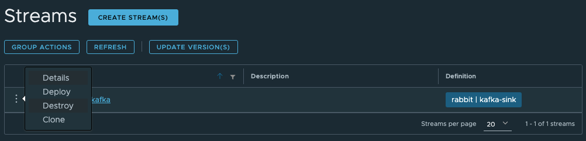
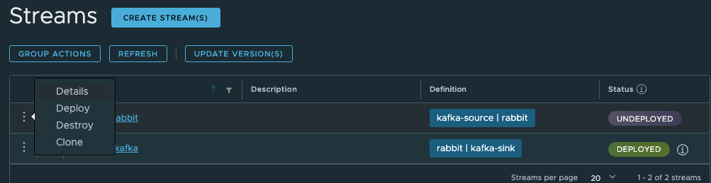

# RabbitMQ and Kafka using Data Flow

See [Tanzu DataFlow for Kubernetes](https://techdocs.broadcom.com/us/en/vmware-tanzu/data-solutions/tanzu-data-flow-kubernetes/2-0/tdf-k8s/index-k8s.html)


See [Tanzu DataFlow for Tanzu Platform](https://techdocs.broadcom.com/us/en/vmware-tanzu/data-solutions/tanzu-data-flow/2-0/tdf-tanzu/index.html)


# Getting Started

See Tanzu Data Flow documentation about.

Also see

- [RabbitMQ Installations](https://www.rabbitmq.com/docs/download)
- [Kafka Installation](https://kafka.apache.org/quickstart/)

## Register Applications 

On Tanzu Platform 

```properties
source.kafka-source=maven://org.springframework.cloud.stream.app:kafka-source-rabbit:5.1.1
sink.kafka-sink=maven://org.springframework.cloud.stream.app:kafka-sink-rabbit:5.1.1
```


On Kubernetes

```properties
source.kafka-source=docker://springcloudstream/kafka-source-rabbit:5.1.1
sink.kafka-sink=docker://springcloudstream/kafka-sink-rabbit:5.1.1
```

-----------------------------------
# RabbitMQ to Kafka

1- Create RabbitMQ Queue

```shell
rabbitmqadmin declare queue name=to-kafka queue_type=quorum
```

2 - Create Kafka Queue

```shell
$KAFKA_HOME/bin/kafka-topics.sh --bootstrap-server=localhost:9092 --create --topic from-rabbit --partitions 1 --replication-factor=1
```

3- Create DataFlow Stream 

Using the DataFlow UI

```shell
rabbit-to-kafka=rabbit --queues=to-kafka --spring.cloud.stream.bindings.output.content-type="application/json" | kafka-sink --topic=from-rabbit --value-serializer=org.apache.kafka.common.serialization.ByteArraySerializer --logging.level.org.springframework.cloud.stream.binder.kafka=DEBUG --logging.level.org.apache.kafka.clients.producer=DEBUG --logging.level.org.springframework.kafka.core.KafkaTemplate=DEBUG
```

4 - Deploy Stream




5 - Send Message to RabbitMQ

```shell
rabbitmqadmin publish  routing_key=to-kafka payload='{"id": "Testing 7"}"'
```

6 - Consume to Kafka messages

```shell
$KAFKA_HOME/bin/kafka-console-consumer.sh --bootstrap-server localhost:9092 --topic from-rabbit --from-beginning
```


---------------
# Kafka to RabbitMQ


1- Create Kafka Topic

```shell
$KAFKA_HOME/bin/kafka-topics.sh --bootstrap-server=localhost:9092 --create --topic to-rabbit  --partitions 1 --replication-factor=1
```


2- Create RabbitMQ Queue

```shell
rabbitmqadmin declare queue name=from-kafka queue_type=quorum
```


3- Create RabbitMQ Exchange

```shell
rabbitmqadmin declare exchange name=from-kafka type=topic
```

3- Create RabbitMQ Bindings

```shell
rabbitmqadmin declare binding source=from-kafka destination=from-kafka destination_type=queue routing_key="#"
```


4 - Create Data Flow Stream

Using the Data Flow UI

```shell
kakfa-to-rabbit=kafka-source --topics=to-rabbit --group-id=kafka-source | rabbit --exchange=from-kafka --routing-key=kafka 
```


5- Deploy Stream




6- Send Data in Kafka

```shell
echo '{ "id" : "Message 3"}' | $KAFKA_HOME/bin/kafka-console-producer.sh --bootstrap-server localhost:9092 --topic to-rabbit
```


7 - Consume Messages from RabbitMQ

```shell
rabbitmqadmin get queue=from-kafka ackmode=ack_requeue_true count=100
```


--------------

# Spring Cloud Stream Applications on Maven Central

## Sink Applications

See https://mvnrepository.com/artifact/org.springframework.cloud.stream.app/kafka-sink-kafka


## Source Applications


See https://mvnrepository.com/artifact/org.springframework.cloud.stream.app/kafka-source-rabbit
